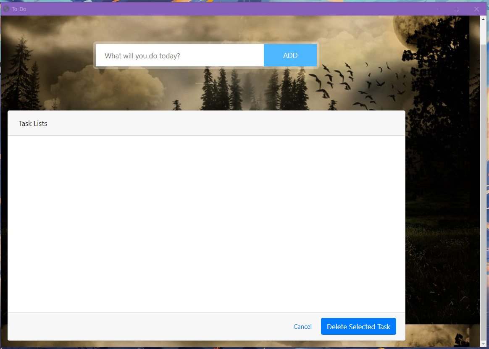
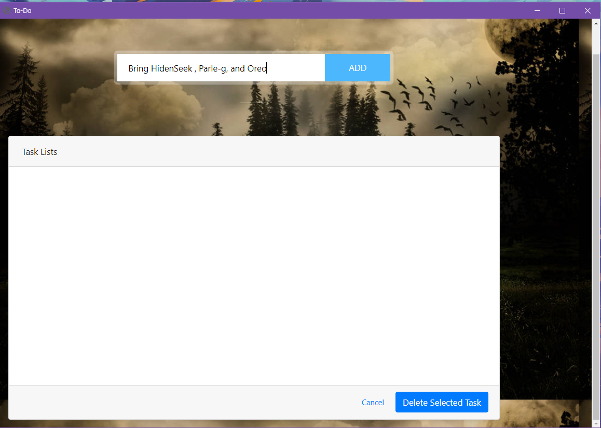
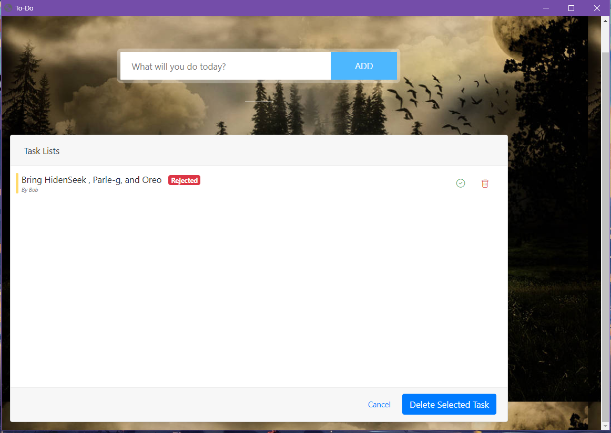
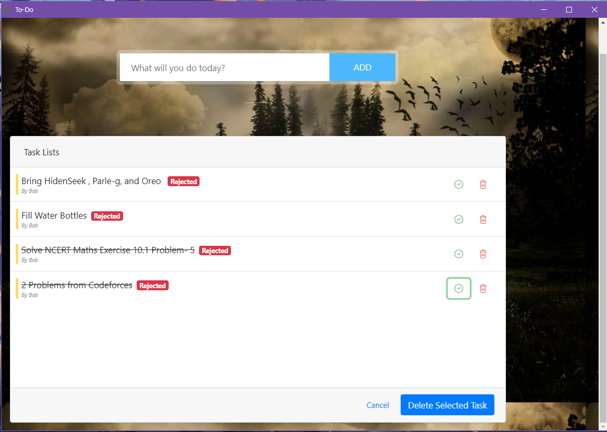
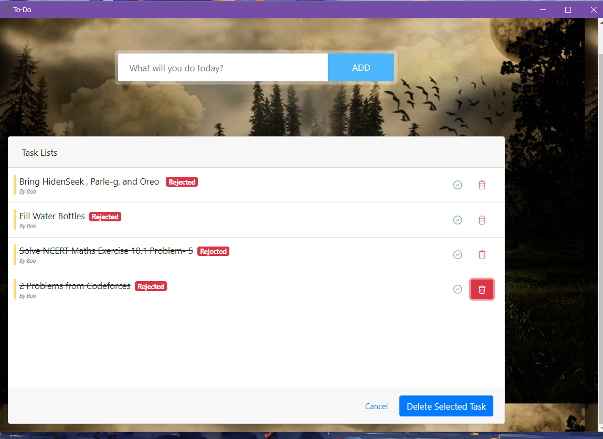

# Todo-DesktopApp

ToDo App is simple and awesome app to organize your tasks with very easy to use interface. ToDo can help you to make list of your tasks and also you can set Reminder with specific tasks. It reminds you at you specified Time. We believe that we only focus on our Today and Tomorrow tasks, which is most important

### UI-Working 
To-Do App is an Application which can be accessed from any platform Desktop/Mobile which using Flask - Restful-Api when Hosted on a Server Such as Heroku or AWS. This Application uses HTML/CSS/Js at the Frontend and Flask at backend server. Sqlite is installed to store all the Task ( Information ) in DBMS format which helps to store the data even when the application is closed and accessed over another PC/Device.  



Add The Todo task to be added



Task is Added to server/sqlite 



Task Once Completed Can be marked As Done But-Only once so that no further Changes can be done.



Once Completed the Task can be removed be selecting the Onces and Then Finaly clicking Delete Selected Task to commit changes within server as well.



### Instructions To Use
```
clone the Github repository
Open Repo. in any Editor such As VScode / Pycharm / Atom / Sublime Text.
Set running environment to venv provided in Scripts
Run the app.py by Direct editor Build or by CMD flask run in root folder
```

### Requirements
1. Flask
2. Flaskwebgui
3. Sqlite(Provided with Python No download required )
### Server Upload
- Uploading this repo to Heroku/AWS will Make this Available to all Platforms 
### Future Upscale
- Can be made Available to multiple Users by creating users Database 
- More Field can be added in the DBMS for more information but Process Remains Same
